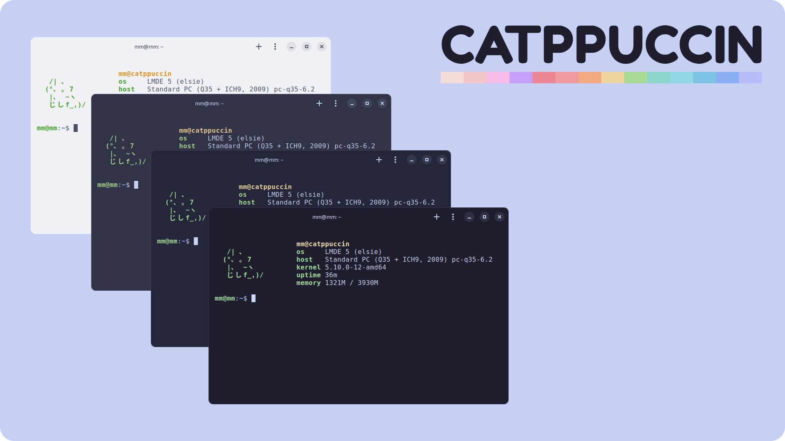

<h3 align="center">
	 
	
	Catppuccin for <a href="https://gitlab.gnome.org/raggesilver/blackbox">Black Box</a>
	
</h3>

    
    
    

  

## Usage

1. Clone this repository locally
2. Open Black Box terminal
3. Go to `Preferences --> General` and scroll down to Theme
4. Click on the link `Open themes folder`
5. Copy themes files from cloned repository `src` folder to Black Box themes folder
6. Restart Black Box
7. Go again to `Preferences --> General` and scroll down to Theme
8. Select Your favourite theme

## 💝 Thanks to

- [elkrien](https://github.com/elkrien)

&nbsp;

Copyright &copy; 2021-present <a href="https://github.com/catppuccin" target="_blank">Catppuccin Org</a>

